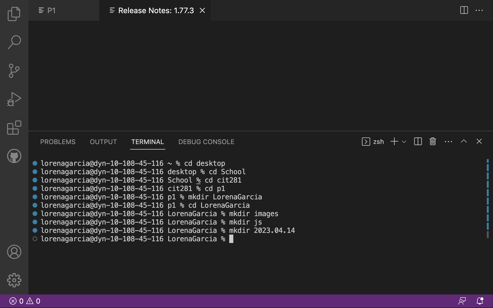
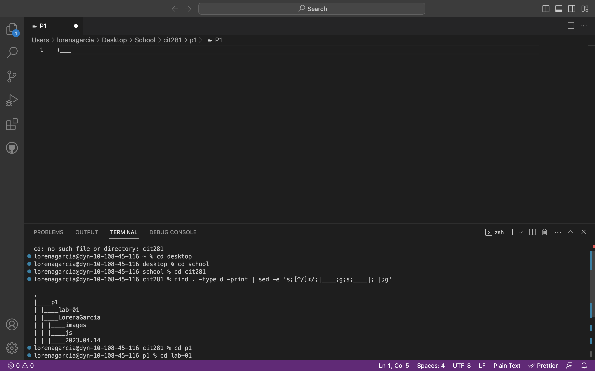

For Project 1, I had a lot of practice using command line commands to create a specific folder structure. The following are submission photos from the project:
 

I learned how to break out of a command line process that appears to be non-functional or stuck and use the appropriate break keyboard sequence. 
Within this project we were also tasked with creating a JavaScript program named "p1-date.js" using Visual Studio Code. 
The program outputed the full name of the current day of the week using an array that contains the days of the week. 

I also created a JavaScript program named "p1-random.js" using Visual Studio Code which was a program outputs
a random string between 5 and 25 characters in length, consisting of random lowercase letters from the English alphabet. 
